# Hammerwork Mermaid Graph Example

This is an example of what the Mermaid output from `cargo hammerwork workflow graph --format mermaid` would look like:

```mermaid
---
title: Hammerwork Workflow Dependency Graph
---
graph TD
    subgraph "📋 Workflow: a1b2c3d4"
        12345678["12345678<br/>Completed<br/>✅ data-processing"]:::completed
        87654321["87654321<br/>Running<br/>⏳ data-transform"]:::running
        abcdef12["abcdef12<br/>Pending<br/>⏳ data-export"]:::pending
        fedcba21["fedcba21<br/>Failed<br/>❌ cleanup"]:::failed

        12345678 --> 87654321
        87654321 --> abcdef12
        87654321 --> fedcba21
    end

    classDef completed fill:#d4edda,stroke:#155724,stroke-width:2px,color:#155724
    classDef failed fill:#f8d7da,stroke:#721c24,stroke-width:2px,color:#721c24
    classDef running fill:#cce7ff,stroke:#004085,stroke-width:2px,color:#004085
    classDef pending fill:#fff3cd,stroke:#856404,stroke-width:2px,color:#856404
    classDef default fill:#e2e3e5,stroke:#383d41,stroke-width:2px,color:#383d41
```

## Features

- **Visual Status Indicators**: Color-coded nodes based on job status
- **Dependency Indicators**: Emojis showing dependency resolution status
- **Queue Information**: Shows which queue each job belongs to
- **Professional Styling**: Bootstrap-inspired color scheme
- **Workflow Grouping**: Jobs are grouped within a labeled subgraph

## Integration

This Mermaid diagram can be embedded in:
- GitHub/GitLab markdown files
- Documentation sites
- VS Code with Mermaid extension
- Mermaid Live Editor (https://mermaid.live/)
- Confluence, Notion, and other documentation platforms

## Legend

- 🔵 No dependencies
- ⏳ Waiting for dependencies
- ✅ Dependencies satisfied
- ❌ Dependency failed

## Status Colors

- 🟢 **Completed**: Light green background
- 🔴 **Failed**: Light red background  
- 🔵 **Running**: Light blue background
- 🟡 **Pending**: Light yellow background
- ⚪ **Other**: Light gray background